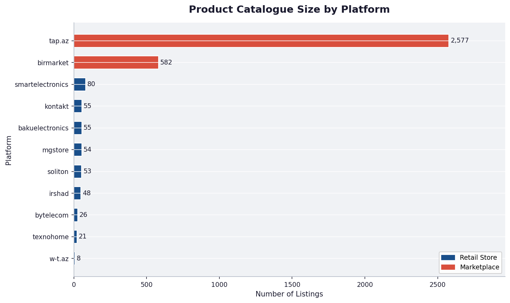
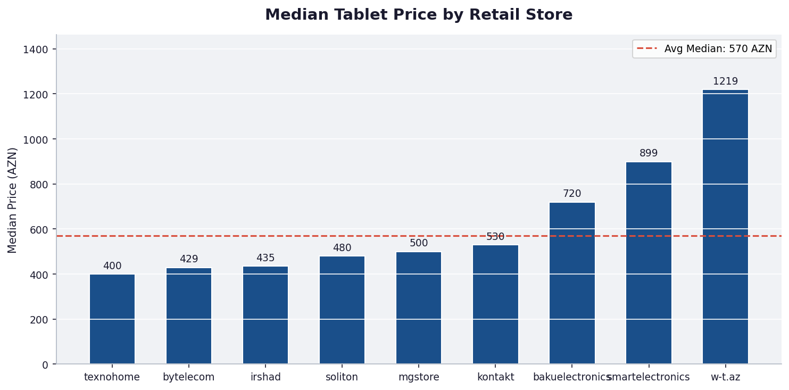
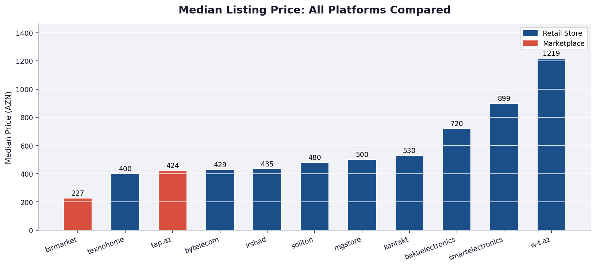
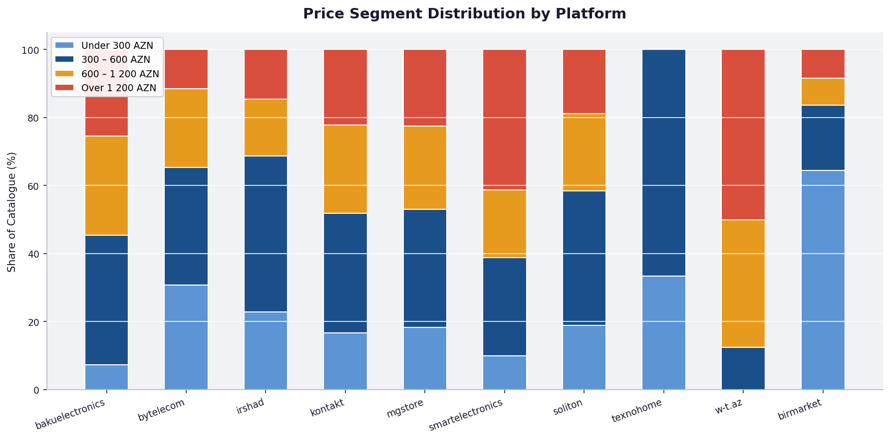
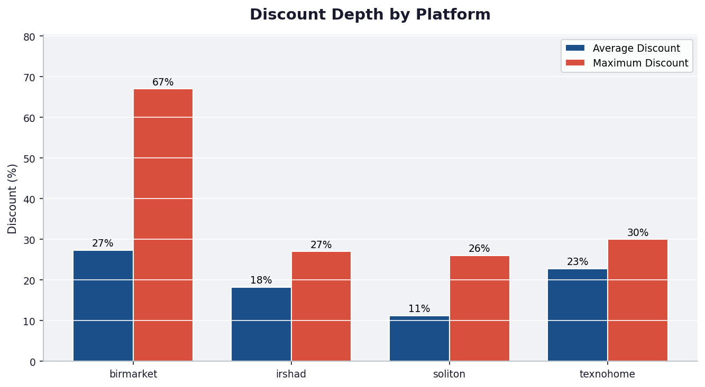
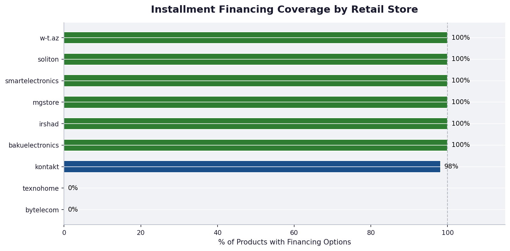
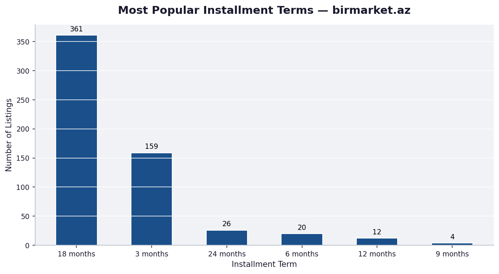
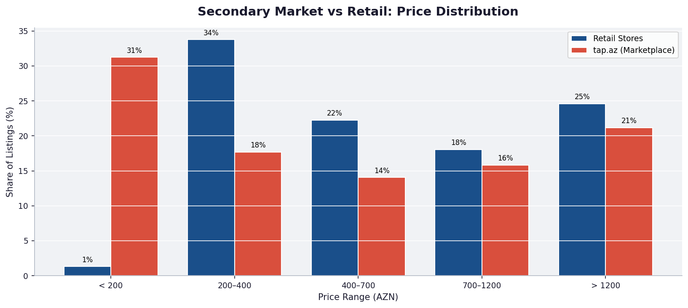
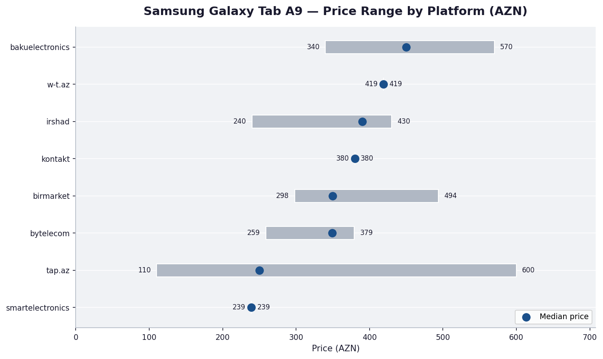

# Azerbaijan Tablet Market — Business Intelligence Report

**Data sources:** 11 platforms &nbsp;|&nbsp; **Total listings:** 3,559 &nbsp;|&nbsp; **Coverage:** 9 retail stores + 2 marketplaces

---

## Executive Summary

This report analyses the tablet market across Azerbaijan's major online retail and resale platforms. The data reveals a market dominated in volume by two marketplaces — **tap.az** and **birmarket.az** — while branded retail stores occupy clearly differentiated price segments. A significant secondary market exists at price points 30–45% below retail, creating meaningful competitive pressure on mid-range models. All key findings are supported by charts in the `charts/` directory.

---

## 1. Market Presence: Who Has the Most Products?

**What the chart shows:** tap.az (2,577 listings) and birmarket.az (582) together account for **87% of all listings** in the dataset. Among dedicated retail stores, smartelectronics.az leads with 80 SKUs, while w-t.az stocks only 8.

**Why it matters:**
- The sheer volume on marketplace platforms means consumers have abundant choice at varying price points, including used and grey-market goods. Retailers that do not compete on price or financing will increasingly lose visibility.
- Smaller retail stores (bytelecom, texnohome, w-t.az) carry narrow catalogues. They must offset limited range with stronger service, faster fulfilment, or exclusive deals.

---

## 2. Where Each Retailer Sits on Price

**What the charts show:** There is a clear three-tier structure across retail stores:

| Tier | Stores | Median Price |
|------|--------|-------------|
| Premium | w-t.az, smartelectronics.az | 1,219 – 899 AZN |
| Mid-market | bakuelectronics.az, kontakt.az, mgstore.az, irshad.az, bytelecom.az, soliton.az | 434 – 720 AZN |
| Budget | texnohome.az | ~400 AZN |

birmarket.az (median 227 AZN) and tap.az (median 424 AZN) sit firmly below every retail store.

**Why it matters:**
- **w-t.az and smartelectronics.az** are operating in the premium segment. Their exposure to price competition from marketplaces is relatively low — buyers in this range are typically seeking warranty, financing, and after-sales support.
- **Mid-market retailers** face the greatest competitive risk: the tap.az median of 424 AZN is within touching distance of their own median prices, and consumers can compare directly.
- **Budget-focused platforms** (birmarket, texnohome) attract buyers primarily on price. Competing here requires operational efficiency or exclusive models.

---

## 3. What Price Ranges Each Platform Focuses On

**What the chart shows:** Each platform targets a distinct slice of the market:

- **smartelectronics.az** — the most premium-skewed retail store: over 40% of its catalogue is priced above 1,200 AZN and nearly 30% between 600–1,200 AZN.
- **kontakt.az & mgstore.az** — balanced mix across mid-range and premium; notably similar catalogues, suggesting potential overlap or shared supplier relationships.
- **birmarket.az** — almost 60% of listings are under 300 AZN, confirming its role as the go-to platform for budget and second-hand tablets.
- **bytelecom.az & soliton.az** — predominantly concentrated in the 300–600 AZN range, targeting the mainstream buyer.

**Why it matters:** Retailers can use this view to identify white-space opportunities. For example, no single retailer dominates the 600–1,200 AZN "upper-mid" band — a competitive gap that a retailer with strong financing could capture.

---

## 4. Who Is Discounting and by How Much?

**What the chart shows:** Only four platforms publicly display discount percentages. birmarket.az leads significantly with an **average discount of 27%** and a maximum of **67%** on individual products. irshad.az and texnohome.az show moderate discounting (18–23%), while soliton.az is the most conservative (11% average).

**Why it matters:**
- birmarket.az's aggressive discounting — particularly on budget brands like Telzeal, Modio, and Discover — signals a strategy built on volume through deep promotions, not margin.
- Retailers that do not communicate discounts on their listing pages (bakuelectronics, kontakt, mgstore, smartelectronics, bytelecom) risk appearing expensive to price-conscious shoppers, even when their net prices are competitive.
- **Recommendation:** Retailers with competitive prices but no visible discount should consider showing original vs. sale price — the perception of a deal can be as powerful as the discount itself.

---

## 5. Financing: A Key Differentiator

**What the chart shows:** Six out of nine retail stores offer installment financing on **100% of their catalogue**: bakuelectronics.az, irshad.az, kontakt.az, mgstore.az, smartelectronics.az, and soliton.az. bytelecom.az and texnohome.az offer no installment options at all.

**Why it matters:**
- In a market where median tablet prices sit between 430–900 AZN, financing is not a luxury feature — it is a purchasing decision enabler for a large share of buyers.
- bytelecom.az, despite carrying 26 products at reasonable prices, offers **zero financing options**. This is a measurable gap that is likely costing them conversion, particularly for purchases above 400 AZN.
- **Recommendation:** Any retailer not offering financing on its full catalogue is leaving revenue on the table, especially in the 600–1,200 AZN segment where single-payment resistance is highest.

**What the chart shows (birmarket.az data):** The **18-month term is by far the most chosen option** (361 listings), followed by 3 months (159) and 24 months (26). The dominance of 18-month terms reveals strong consumer preference for the lowest monthly payment, not the shortest commitment.

**Why it matters:** Retailers that only offer 6-month or 12-month plans may be losing buyers who cannot afford the higher monthly payments those shorter terms imply. Offering an 18-month (or 24-month) option can expand addressable demand without changing the listed price.

---

## 6. The Secondary Market Challenge

**What the chart shows:** **41% of tap.az listings are priced below 300 AZN** — a segment almost entirely absent from retail stores. Retail stores concentrate in the 300–700 AZN range, while tap.az has substantial listings across every price band, including 26% above 1,000 AZN (often newer models sold by individuals shortly after purchase).

**Why it matters:**
- There is a large, active secondary market at sub-300 AZN price points. Retail stores do not compete here and should not try — these are primarily older or used devices.
- The overlap in the 400–700 AZN band is where the real competitive pressure occurs: a buyer can find a used or grey-import tablet at a similar price to a new retail unit. **Retail must differentiate on warranty, return policy, and after-sales service** to justify the same price point.
- The 26% of tap.az listings above 1,000 AZN represents individual resellers of premium devices, sometimes at prices competitive with or exceeding retail. This indicates strong underlying demand for premium tablets — a segment retailers should protect with financing and exclusive availability.

---

## 7. Real-World Price Comparison: Samsung Galaxy Tab A9

**What the chart shows:** The Samsung Galaxy Tab A9 is one of the most widely listed models across all platforms — making it an ideal benchmark. The chart shows the full price range (minimum to maximum) and median price per platform.

Key observations:
- **tap.az** shows the widest price range (130–600 AZN), reflecting both heavily used units at the low end and near-new resale at the high end.
- **irshad.az** offers the lowest new-retail price (from 240 AZN), while **bakuelectronics.az** sits at the upper end of retail (340–570 AZN for various configurations).
- **w-t.az** lists a single configuration at 419 AZN — above the median for most competitors.
- The median across all retail channels for this model is approximately 350–390 AZN, creating a clear reference point.

**Why it matters:** For any retailer stocking Samsung Galaxy Tab A9, the market will not sustain a price much above 390 AZN for the base configuration — tap.az listings at 200–250 AZN set a visible floor in consumer perception. Retailers should either differentiate with bundle offers, warranty extensions, or trade-in programs, or focus promotional efforts on newer models with less secondary-market pressure.

---

## 8. Key Recommendations

| Priority | Recommendation | Platforms Affected |
|----------|---------------|-------------------|
| High | Add installment financing across the full catalogue | bytelecom.az, texnohome.az |
| High | Display original vs. discounted prices visibly | bakuelectronics, kontakt, mgstore, smartelectronics |
| Medium | Introduce 18-month financing options | Any retailer offering only 6–12 month terms |
| Medium | Emphasise warranty and after-sales differentiation in the 400–700 AZN band | All mid-market retailers |
| Medium | Focus premium-segment marketing on warranty, exclusivity, and in-store experience | w-t.az, smartelectronics.az |
| Low | Review catalogue breadth — narrow range limits cross-sell opportunity | bytelecom.az, texnohome.az, w-t.az |

---

## Appendix: Data Coverage

| Platform | Type | Listings | Price Data | Financing Data |
|----------|------|----------|------------|----------------|
| tap.az | Marketplace | 2,577 | Full | Not available |
| birmarket.az | Marketplace | 582 | Partial | Full (term + monthly) |
| smartelectronics.az | Retail | 80 | Full | Full |
| bakuelectronics.az | Retail | 55 | Full | Full |
| kontakt.az | Retail | 55 | Full | Full |
| mgstore.az | Retail | 54 | Full | Full |
| soliton.az | Retail | 53 | Full | Full |
| irshad.az | Retail | 48 | Full | Full |
| bytelecom.az | Retail | 26 | Full | None |
| texnohome.az | Retail | 21 | Partial* | None |
| w-t.az | Retail | 8 | Full | Full |

*texnohome.az shows 0.00 price for out-of-stock items; 9 of 21 products have valid pricing.

---

*Data collected February 2026. Charts generated by `scripts/generate_charts.py`. Combined dataset at `data/data.csv`.*
